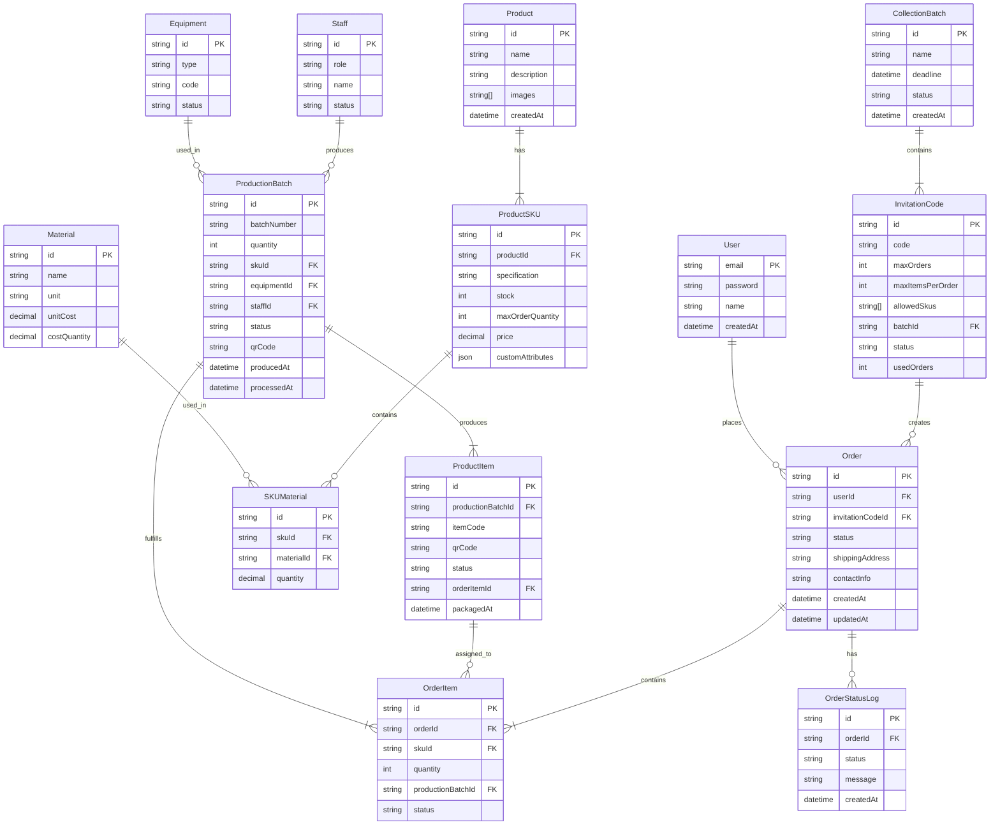

# 基本需求

1. 商品（月饼），可能会有多个 sku（比如口味），而且每个 sku 独立库存，并且每个订单最大数量也有限制，同时可以有自定义属性（json）
2. 制造商（烤箱、制作人、批次），用于商品溯源或者订单状态查询
3. 原料（糯米粉等），商品 sku 可关联原料，原料应有名称、单位、成本计量的单个数量和单价
4. 订单采集，使用邀请码机制，生成邀请码时对应可以创建几个订单、每个订单最大商品数量、可选的 sku 这样，然后采集的数据包括采购商品列表、收货地址、联系方式，订单创建会关联到用户，采集应该按照批次，每一批次都有固定截止时间，采集码应该关联到批次上
5. 用户，用户使用邮箱注册与登录，创建订单时收取邮箱验证码来绑定到用户
6. 管理后台，用于管理商品、制造商、订单

# 工作流程

0. 管理后台创建各种口味月饼、烤箱实体、糕点师实体，然后创建采集批次
1. 管理后台创建采集码，发给自然人
2. 自然人使用采集码创建订单，并自动创建用户
3. 糕点师可以根据所有订单 一键生成采购原料的数量
4. 糕点师可以根据某口味的月饼生成一个制作批次，包含数量、口味、批次号，并且自动跟订单进行关联，并打印为一维码贴纸
5. 糕点师在将月饼放进烤箱时扫描一维码贴纸，用于关联溯源与订单状态更新
6. 某一烤箱批次的月饼在包装时都会有独立的贴纸，包装时先扫描批次贴纸，然后扫描月饼贴纸用于关联溯源，并在贴纸上面自动打印订单信息，用于订单打包
7. 最后就是发货
8. 在这一过程中订单状态会有所更新，更新时会发送邮件给用户，同时用户可以通过查看订单状态页面

# 框架使用

## 前端

- typescript
- vite
- react
- tanstack router
- tanstack query
- tailwindcss
- mui
- react-hook-form
- zustand
- zod

## 后端

- typescript
- typeorm
- express
- zod

# ER

